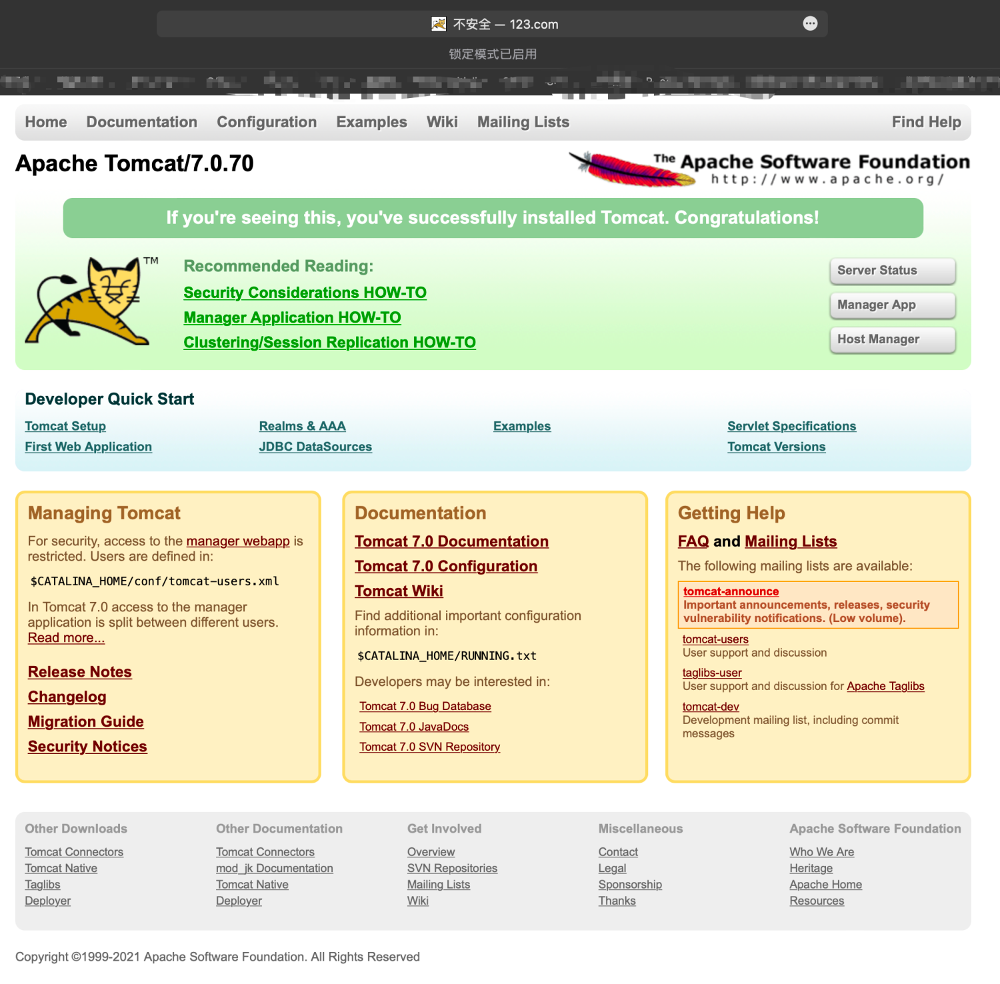

1.实线效果

(1)打开浏览器,在浏览器地址栏输入www.123.com 跳转到linux中tomcat页面

2.准备工作

(1)在linux系统安装tomcat,使用默认端口8080
tomcat安装文件scp到linux中,tar -xvf解压
进入tomcat的bin目录中,运行./startup.sh启动tomcat服务器

(2)对外开放访问的端口
firewall-cmd --add-port=8080/tcp --permanent
firewall-cmd --reload
查看已经开放的端口号:
firewall-cmd --list-all

(3)在宿主机通过浏览器访问tomcat服务器主页面

3.访问过程的分析

4.具体配置
第一步 在hosts文件中进行域名和ip对应关系的配置

第二步 在nginx配置文件中进行请求转发的配置(反向代理配置)

5.测试
nginx -t 测试配置是否有效
nginx -s reload  重新加载nginx配置文件

6.效果展示

